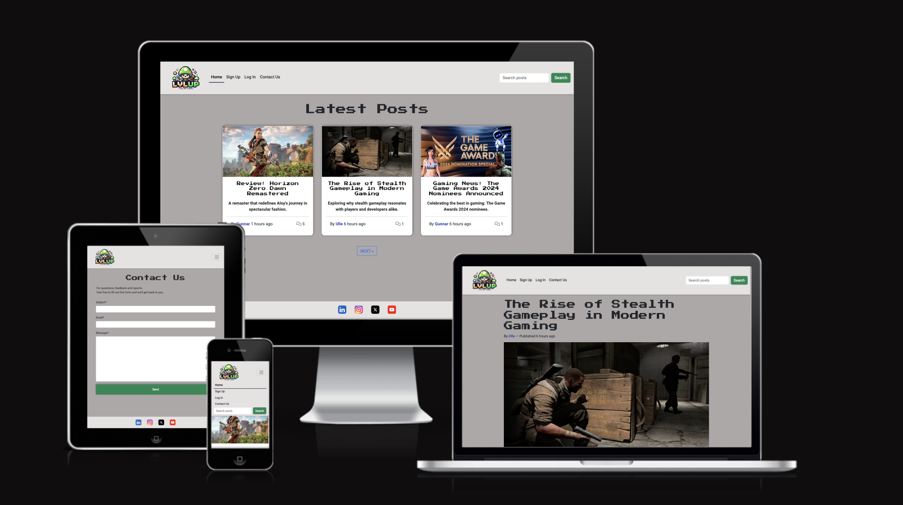
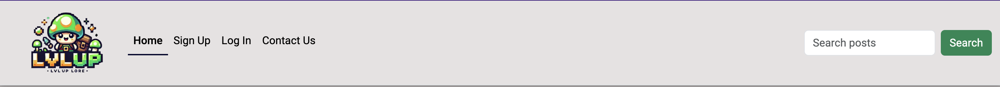

# LVL-UP Lore

## Live Project

The live project can be viewed here: [LVL-UP Lore](https://lvlup-lore-627e6743039a.herokuapp.com/)

Welcome to **LVL-UP Lore**, a gaming blog where admins can share gaming-related posts, and users can engage through comments. This project emphasizes delivering core functionality with a clean, responsive interface. The platform fosters open discussions while ensuring respectful interactions.

---

## Table of Contents

- [LVL-UP Lore](#lvl-up-lore)
  - [Live Project](#live-project)
  - [Table of Contents](#table-of-contents)
  - [Purpose and Demographic](#purpose-and-demographic)
  - [UX Design](#ux-design)
    - [The Strategy](#the-strategy)
      - [Project Goals](#project-goals)
    - [Assignment Requirements](#assignment-requirements)
    - [Planning and Project Management](#planning-and-project-management)
    - [User Stories](#user-stories)
      - [For Users](#for-users)
      - [For Admins](#for-admins)
    - [The Scope](#the-scope)
      - [Features Included](#features-included)
      - [Features Excluded](#features-excluded)
  - [Features](#features)
    - [Header Navigation](#header-navigation)
    - [Search Bar](#search-bar)
  - [Design Choices](#design-choices)
      - [Typography](#typography)
      - [Color Scheme](#color-scheme)
  - [Database Design](#database-design)
    - [Entity Relationship Diagram (ERD)](#entity-relationship-diagram-erd)
  - [Future Features](#future-features)
  - [Testing](#testing)
  - [Setup and Deployment](#setup-and-deployment)
    - [Create Repository](#create-repository)
    - [Deployment to Heroku](#deployment-to-heroku)
  - [Acknowledgments](#acknowledgments)

---

## Purpose and Demographic

**LVL-UP Lore** is designed for:
- **Gaming enthusiasts** who want to stay updated on gaming trends.
- **Users** who want to express their opinions freely while adhering to respectful interactions.
- **Admins** or **content creators** who require easy-to-use tools for managing blog posts and moderating user activity.
---

## UX Design

### The Strategy

Click to expand

#### Project Goals
1. Build a platform where users can access gaming-related posts and interact with them.
2. Provide admins with tools for managing content effectively, including posts, comments, and feedback.
3. Deliver a responsive, visually appealing site for users across all devices.

---

### Assignment Requirements

Click to expand

1. **Functionality**: Create a fully functional web application where users can post and comment on blogs.
2. **User Authentication**: Implement secure user registration and login capabilities.
3. **Database Management**: Use Django ORM to handle data storage for posts, comments, and user profiles.
4. **Responsive Design**: Ensure the website adapts seamlessly to different screen sizes.
5. **User Interface**: Build a clean, user-friendly interface with Bootstrap.
6. **Testing and Accessibility**: Validate the code, ensure accessibility, and conduct thorough testing.
7. **Documentation**: Provide clear project documentation.

---

### Planning and Project Management

Click to expand

This project followed Agile principles. Tasks were managed with a Kanban board:

- **To Do**: Tasks not yet started.
- **In Progress**: Tasks currently being worked on.
- **Completed**: Finished tasks.

View the board here: [GitHub Project Board](https://github.com/users/andreasawenlof/projects/5).

---

### User Stories

Click to expand

#### For Users
1. Browse gaming-related posts.
2. Comment on posts and edit or delete their own comments.
3. Search for posts by title.
4. View user profiles.

#### For Admins
1. Create, edit, and delete posts.
2. Moderate user comments.
3. Respond to inquiries via the contact form.

---

### The Scope

Click to expand

#### Features Included
1. **Dynamic Navigation** based on user role (guest, logged-in user, or admin).
2. **CRUD Operations** for comments and posts.
3. **User Profiles** with bio and activity tracking.
4. **Search Bar** for post titles.
5. **Contact Form** for inquiries.
6. **Responsive Design** via Bootstrap.

#### Features Excluded
1. Dark mode (planned for future updates).
2. AJAX for real-time updates.
3. Advanced search functionality.

---

## Features

### Header Navigation

### Search Bar

Click to expand

---

## Design Choices

Click to expand

#### Typography
- **Roboto** for readability.
  
- **Press Start 2P** for a retro gaming vibe.
  

#### Color Scheme
- Neutral tones for backgrounds.
- Accent green for buttons and links.
  

---

## Database Design

### Entity Relationship Diagram (ERD)

Click to expand

The database includes:
1. **User**: Handles authentication.
2. **Post**: Stores blog content.
3. **Comment**: Tracks user interactions.
4. **Profile**: Manages user-specific data.

---

## Future Features

Click to expand

1. **Profile Editing**.
2. **Dark Mode**.
3. **Advanced Search**.
4. **AJAX for Real-Time Updates**.

---

## Testing

The site was tested for functionality, responsiveness, and browser compatibility. Detailed results are available in the [TESTING.md](TESTING.md).

---

## Setup and Deployment

### Create Repository

Click to expand

1. Log in to GitHub.
2. Create a new repository from the Gitpod Full Template.
3. Push code to GitHub.

---

### Deployment to Heroku

Click to expand

1. Set up Heroku with your application.
2. Add necessary environment variables (e.g., `SECRET_KEY`, `DATABASE_URL`).
3. Deploy via GitHub integration.

---

## Acknowledgments

- **Mentor**: Gareth for the invaluable guidance.
- **Swedish Slack Community**: For consistent support.
- **Family**: For their understanding and encouragement.

---
